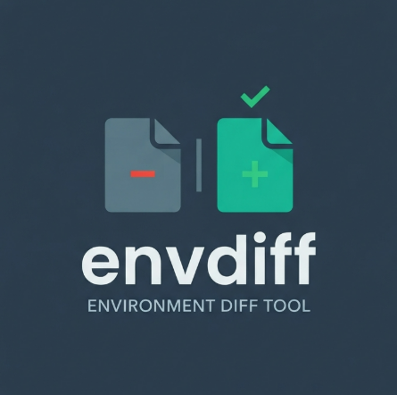

<p align="center">
  
</p>

# envdiff

Catch broken `.env` files before your app crashes.

`envdiff` compares your real `.env` against a reference `.env.example` and reports
what's wrong — missing keys, extra keys, empty values, duplicates, type mismatches,
placeholders you forgot to fill in, and secrets that shouldn't be committed. It can
also scan a whole project tree at once and warn when a real `.env` isn't protected by
`.gitignore`. Zero runtime dependencies. Ships as a single binary or a tiny npm package.

```
$ envdiff

envdiff  .env  vs  .env.example

  x ERROR missing key "SERVER_PORT" (defined in example)
  x ERROR "DATABASE_URL" = "localhost5432" is not a valid url
  x ERROR "ADMIN_EMAIL" = "admin(at)example.com" is not a valid email
  x ERROR "DEBUG" = "sometimes" is not a valid boolean
  ! WARN  key "MAX_RETRIES" is empty:17
  ! WARN  "AWS_ACCESS_KEY_ID" looks like a AWS access key id:20
  ! WARN  "JWT_SECRET" secret-like key has a concrete value:26
  ! WARN  duplicate definition of "NODE_ENV" (last value wins):29
  ! WARN  extra key "LEGACY_FLAG" (not in example):32

  4 errors  ·  5 warnings
```

## Why

Every developer has hit it: clone a repo, run the app, and it explodes because
an env var is missing, empty, or malformed. The `.env.example` is supposed to
prevent that, but nothing actually checks your `.env` against it. `envdiff` does.

## Install

**As a standalone binary** (no Node.js required on the target machine):

Download `envdiff.exe` (Windows) from the releases page and put it on your PATH.

**As an npm package:**

```
npm install -g envdiff
```

## Usage

```
envdiff                        interactive: prompts for a folder to scan
envdiff --scan <dir>           scan a directory tree for env files
envdiff <env-file> <example>   compare two specific files
```

Run with no arguments (or double-click the `.exe`) and envdiff prompts for a folder,
scans it recursively, and holds the window open so the output doesn't flash and vanish.
Point it at two files and it compares just those.

| Option | Description |
| --- | --- |
| `-s, --scan <dir>` | scan a directory recursively for `.env` / `.env.example` pairs |
| `-e, --env <path>` | path to the real env file (default: `.env`) |
| `-x, --example <path>` | path to the reference file (default: `.env.example`) |
| `--json` | output findings as JSON (for CI) |
| `--no-secrets` | skip secret detection |
| `--no-types` | skip type validation |
| `--no-git` | skip the `.gitignore` exposure check (scan mode) |
| `--no-color` | disable ANSI colors |
| `--no-pause` | don't wait for a keypress before exiting |
| `--strict` | treat warnings as errors (non-zero exit) |
| `-h, --help` | show help |
| `-v, --version` | show version |

**Exit codes:** `0` = clean, `1` = errors found (or warnings in `--strict`), `2` = usage error.
This makes `envdiff` drop-in for a CI gate or a pre-commit hook.

## What it checks

- **Missing keys** — defined in the example but absent from your `.env` (error;
  downgraded to a warning if the example marks the key `# optional`).
- **Extra keys** — in your `.env` but not the example (warning).
- **Empty values** — key present but blank (warning).
- **Duplicate definitions** — same key set twice (warning; last value wins).
- **Type mismatches** — value doesn't match its expected type (error). Types come
  from an explicit hint in the example (`PORT=  # type: port`) or are inferred from
  the key name (`*_URL`, `*_PORT`, `*_EMAIL`, `DEBUG`, `MAX_*`, …).
- **Secrets** — real-looking credentials: AWS keys, GitHub tokens, Slack tokens,
  Stripe keys, JWTs, private key blocks, high-entropy strings, and AI provider
  API keys (OpenAI, Anthropic, Google/Gemini, OpenRouter, Hugging Face, Groq,
  xAI, Replicate, Perplexity). Flagged as a warning in `.env`, and as an **error**
  in the example file (where only placeholders belong).
- **Unfilled placeholders** — a key whose value is still identical to the example's
  placeholder, or still contains a `<template>` marker (warning). Catches the
  "copied the example but never filled it in" mistake.
- **Git exposure** — a populated `.env` that isn't covered by `.gitignore`, so its
  values could be committed and made public. An error in scan mode, a warning in
  pair mode. Catches credentials one `git add` away from leaking.

## Type hints

Annotate keys in your `.env.example` with a trailing comment:

```
SERVER_PORT=     # type: port required
DATABASE_URL=    # type: url required
DEBUG=           # type: boolean optional
```

Supported types: `number`, `integer`, `boolean`, `url`, `httpurl`, `email`, `port`, `json`,
`string`, `any` (the last two accept anything — use them to document intent).

## CI example

```yaml
# .github/workflows/env.yml
- run: npx envdiff --strict --json
```

## Development

```
npm test              # run the test suite (no dependencies)
npm run build:exe     # produce a standalone Windows binary via @yao-pkg/pkg
```

## License

MIT

---

Made By mango_magic123456 on Discord
